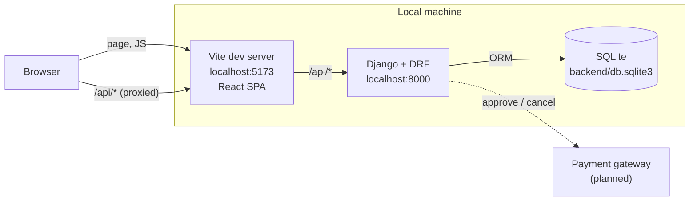

# Architecture

coffee-shop runs only on a local machine for the course demo. It is two processes: a Vite
dev server that serves the React front-end, and a Django server that serves the REST API.
Nothing is deployed.

## System overview



- The browser only talks to `localhost:5173`. Vite forwards every `/api` request to Django
  (`server.proxy` in `frontend/vite.config.js`), so there is no CORS setup.
- Front-end and back-end exchange JSON over REST only.
- `localhost:8000` serves only `/api/` and `/admin/`. Its root returns 404.

## Front-end

| Item | Choice |
|------|--------|
| Framework | React 19 with Vite |
| Styling | Tailwind CSS through `@tailwindcss/vite` |
| Routing | react-router-dom (installed, routes not built yet) |
| HTTP | One axios instance in `frontend/src/api/client.js` with `baseURL: "/api"` |
| State | `useState` and props only, no state management library |

- Every API call goes through `client.js`. An interceptor that attaches the access token and
  refreshes it on 401 is planned there.
- Screens follow [screen-list.md](frontend/screen-list.md) (SCR-01 to SCR-14) and the
  [wireframes](frontend/wireframes/).

## Back-end

The Django project is `backend/config`. Domain code is split into three apps:

| App | Models | Tables |
|-----|--------|--------|
| `users` | `User`, `UserAddress` | `users`, `user_addresses` |
| `products` | `Product`, `ProductOption` | `products`, `product_options` |
| `orders` | `CartItem`, `Order`, `OrderItem`, `Payment` | `cart_items`, `orders`, `order_items`, `payments` |

- Django REST Framework handles the API. `JWTAuthentication` from
  `djangorestframework-simplejwt` is the default authentication class.
- Implemented endpoints today: `POST /api/token/`, `POST /api/token/refresh/`, and the Django
  admin at `/admin/`. Domain endpoints are defined in the API spec (#14).
- Settings read `SECRET_KEY` and `DEBUG` from `.env` at the repository root through
  python-dotenv. `.env` is never committed; `.env.example` lists the keys.

## Data

- One SQLite file, `backend/db.sqlite3`, created locally and never committed.
- Tables, columns, constraints, and indexes are specified in
  [table-specification.md](backend/table-specification.md). `backend/schema.sql` holds the
  matching DDL.
- Order items store a snapshot of product name, option, and price, so later catalog changes
  do not alter past orders.

## Request flow

A typical authenticated call, for example loading a member's orders:

1. React calls `client.get("/orders/")`, which requests `/api/orders/` from the Vite server.
2. Vite proxies the request to `localhost:8000/api/orders/`.
3. DRF validates the `Authorization: Bearer <access token>` header.
4. The view queries the `orders` app through the Django ORM and returns JSON.
5. If the access token has expired, the front-end calls `/api/token/refresh/` and retries.

The `/api/orders/` endpoint and the refresh interceptor are not built yet, so this flow is
the target design.

## Directory layout

```
coffee-shop/
├── backend/
│   ├── config/          Django settings and root URLs
│   ├── users/           User, UserAddress
│   ├── products/        Product, ProductOption
│   ├── orders/          CartItem, Order, OrderItem, Payment
│   ├── schema.sql       SQLite DDL
│   └── requirements.txt
├── frontend/
│   ├── src/
│   │   ├── api/client.js   the only axios instance
│   │   ├── App.jsx
│   │   └── main.jsx
│   └── vite.config.js      /api proxy
├── docs/                 requirements and design documents
└── .env.example
```

## Known gaps

- The apps have no committed migrations, so `python manage.py migrate` does not create the
  domain tables yet.
- `users.User` is a plain model, not a Django auth user. The token endpoints currently
  authenticate against Django's built-in `auth_user` table, so they need to be connected to
  `users.User` when the auth API is built.
- Payment gateway integration is not implemented.

## Related documents

- [tech-stack.md](tech-stack.md) - technology choices and versions
- [backend/requirements.md](backend/requirements.md) - requirements definition
- [backend/class-diagram.drawio.svg](backend/class-diagram.drawio.svg) - class diagram
- [frontend/sequence-diagrams/](frontend/sequence-diagrams/) - sequence diagrams
