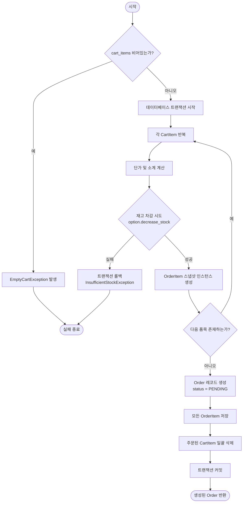
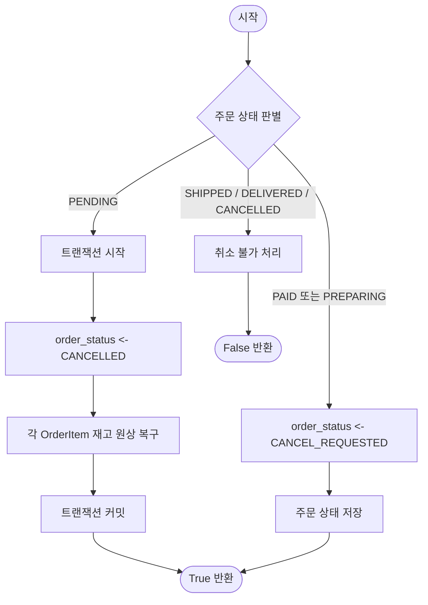

# 3. 메소드 알고리즘 설계 (Method Algorithm Design)

커피 원두 쇼핑몰 시스템의 백엔드 핵심 비즈니스 로직에 대한 **메소드 알고리즘 설계서**이다. SDD(소프트웨어 설계 명세서) 제3절 및 `docs/deliverables.md`의 **"Method algorithm design and implementation"** 산출물에 해당한다.

클래스 명세(`class-specification.md`)와 데이터베이스 스키마(`table-specification.md`)에서 정의된 인터페이스를 바탕으로, 트랜잭션 일관성, 재고 동시성 제어, 불변 스냅샷 생성, 결제 및 배송 상태 머신 전이를 담당하는 **핵심 6대 알고리즘**을 상세히 기술한다.

---

## 1. 알고리즘 목록 요약

| ID | 알고리즘 명칭 | 대상 클래스 / 메서드 | 주요 책임 및 비즈니스 목적 |
|---|---|---|---|
| **ALG-01** | 주문 생성 및 재고 원자적 차감 | `Order.create_order` | 장바구니 품목 검증, 원자적 재고 차감, 주문 스냅샷 생성, 트랜잭션 커밋/롤백 |
| **ALG-02** | 회원 주문 취소 요청 | `Order.request_cancellation` | 주문 상태에 따른 즉시 취소 또는 취소 요청(`CANCEL_REQUESTED`) 전이 |
| **ALG-03** | 관리자 주문 취소 심사 및 환불 | `Order.process_cancellation` | 취소 승인 시 재고 원자적 복구, PG 결제 자동 환불 호출, 반려 시 상태 복구 |
| **ALG-04** | 재고 증감 및 자동 품절 판별 | `ProductOption.decrease_stock`<br>`ProductOption.increase_stock` | 재고 음수 방지 검증, 전체 옵션 소진 시 부모 원두 자동 품절(`SOLD_OUT`) 전환 및 복구 |
| **ALG-05** | 배송 추적 등록 및 완료 | `Order.register_tracking`<br>`Order.mark_as_delivered` | 운송장 번호 등록, 출고 일시 기록, 주문 상태 전이(`SHIPPED` → `DELIVERED`) |
| **ALG-06** | 사용자 인증 및 비밀번호 변경 | `User.login`<br>`User.change_password` | 단방향 솔트 해시 대조, 기존 암호 검증 후 신규 해시 갱신 및 보안 유지 |

---

## 2. 상세 알고리즘 설계

---

### ALG-01: 주문 생성 및 재고 원자적 차감 (`Order.create_order`)

#### 1. 개요 및 목적
회원이 장바구니에 담긴 원두 옵션들을 주문할 때, 모든 품목의 재고를 원자적으로 차감하고 주문 시점의 스냅샷(`OrderItem`)을 생성하여 결제 대기(`PENDING`) 상태의 `Order`를 생성한다. 중간에 어떤 품목이라도 재고가 부족하면 전체 작업을 롤백하여 데이터 무결성을 보장한다.

#### 2. 입출력 명세
- **입력 (Input)**:
  - `user: User`: 주문을 생성하는 회원 객체
  - `order_id: String`: 고유 주문 비즈니스 번호 (예: `ORD-20261008-001`)
  - `recipient_name: String`: 수령인 성명
  - `recipient_phone: String`: 수령인 연락처
  - `shipping_address: String`: 배송지 주소
  - `cart_items: List[CartItem]`: 주문 대상 장바구니 품목 목록
  - `shipping_fee: int`: 배송비 (기본값: 3,000 KRW)
- **출력 (Output)**:
  - `order: Order`: 생성된 주문 인스턴스
- **예외 (Exceptions)**:
  - `EmptyCartException`: `cart_items`가 비어있는 경우
  - `InsufficientStockException`: 품목 중 재고 수량이 부족한 경우 (`ValueError`)

#### 3. 사전 및 사후 조건 (Pre/Post-conditions)
- **사전 조건**: `user`는 인증된 회원이어야 하며, `cart_items`의 각 품목은 유효한 `ProductOption`을 참조해야 한다.
- **사후 조건**:
  - 주문 대상 `ProductOption`들의 `stock_quantity`가 요청 수량만큼 감소한다.
  - 주문 마스터(`Order`)와 상세 항목(`OrderItem`)이 데이터베이스에 저장된다.
  - 결제 대상이 된 `CartItem` 레코드는 데이터베이스에서 삭제된다.
  - 실패 시 데이터베이스는 실행 전 상태로 완전 롤백된다.

#### 4. 제어 흐름 다이어그램


#### 5. 상세 의사코드 (Pseudocode)
```text
ALGORITHM Order_CreateOrder(user, order_id, recipient_name, recipient_phone, 
                           shipping_address, cart_items, shipping_fee)
BEGIN
    IF cart_items IS EMPTY THEN
        RAISE EmptyCartException("주문할 장바구니 항목이 존재하지 않습니다.")
    END IF

    START TRANSACTION
    TRY
        total_product_amt <- 0
        order_item_instances <- EMPTY_LIST

        FOR EACH item IN cart_items DO
            // 1. 주문 시점 옵션 결합 단가 산출
            unit_price <- item.option.product.base_price + item.option.extra_price
            subtotal <- unit_price * item.quantity
            total_product_amt <- total_product_amt + subtotal

            // 2. 원자적 재고 차감 시도
            stock_decreased <- item.option.decrease_stock(item.quantity)
            IF stock_decreased IS FALSE THEN
                RAISE InsufficientStockException("재고가 부족합니다: " + item.option.product.name)
            END IF

            // 3. 주문 불변 스냅샷 인스턴스 준비
            order_item <- INSTANTIATE OrderItem WITH
                option <- item.option,
                product_name <- item.option.product.name,
                weight_size <- item.option.weight_size,
                grind_type <- item.option.get_grind_type_display(),
                order_price <- unit_price,
                quantity <- item.quantity
            
            APPEND order_item TO order_item_instances
        END FOR

        // 4. 최종 결제 금액 산출
        final_payment_amt <- total_product_amt + shipping_fee

        // 5. 주문 마스터 생성 (기본 상태 PENDING)
        order <- INSERT INTO Order VALUES (
            order_id <- order_id,
            user <- user,
            order_status <- OrderStatus.PENDING,
            total_product_amt <- total_product_amt,
            shipping_fee <- shipping_fee,
            final_payment_amt <- final_payment_amt,
            recipient_name <- recipient_name,
            recipient_phone <- recipient_phone,
            shipping_address <- shipping_address
        )

        // 6. 주문 상세 항목 외래키 연결 및 일괄 영속화
        FOR EACH oi IN order_item_instances DO
            oi.order <- order
            INSERT oi INTO OrderItem
        END FOR

        // 7. 주문 완료된 장바구니 품목 제거
        DELETE FROM CartItem WHERE id IN cart_items

        COMMIT TRANSACTION
        RETURN order

    CATCH Exception AS e
        ROLLBACK TRANSACTION
        RAISE e
    END TRY
END
```

#### 6. 복잡도 및 동시성 분석
- **시간 복잡도**: $O(N)$ ($N$ = 장바구니 품목 수)
- **공간 복잡도**: $O(N)$ (생성된 스냅샷 객체 수)
- **동시성 제어**: `decrease_stock`은 단일 DB 트랜잭션 내에서 실행되며, SQLite/RDBMS의 Row-Level Lock 또는 격리 수준에 의해 동시에 동일 상품의 마지막 재고를 주문하더라도 한 쪽만 성공하고 다른 트랜잭션은 롤백된다.

---

### ALG-02: 회원 주문 취소 요청 (`Order.request_cancellation`)

#### 1. 개요 및 목적
회원이 주문 내역에서 취소를 요청할 때, 주문의 현재 상태에 따라 적절한 분기 처리를 수행한다. 아직 결제되지 않은 주문(`PENDING`)은 즉시 취소하고 재고를 복원하며, 결제 완료(`PAID`) 또는 상품 준비 중(`PREPARING`)인 주문은 관리자 확인을 위해 상태를 `CANCEL_REQUESTED`로 전이시킨다. 이미 출고된 주문(`SHIPPED`, `DELIVERED`)은 취소를 불허한다.

#### 2. 입출력 명세
- **입력 (Input)**:
  - `self: Order`: 취소 대상 주문 객체
- **출력 (Output)**:
  - `success: bool`: 취소 요청 접수 또는 즉시 취소 성공 여부

#### 3. 사전 및 사후 조건 (Pre/Post-conditions)
- **사전 조건**: 대상 주문이 데이터베이스에 존재해야 한다.
- **사후 조건**:
  - `PENDING` 주문: `order_status`가 `CANCELLED`로 변경되고 재고가 환원된다.
  - `PAID` / `PREPARING` 주문: `order_status`가 `CANCEL_REQUESTED`로 변경된다.
  - 기타 상태: 상태 변경 없이 `False`를 반환한다.

#### 4. 제어 흐름 다이어그램


#### 5. 상세 의사코드 (Pseudocode)
```text
ALGORITHM Order_RequestCancellation(order)
BEGIN
    IF order.order_status == OrderStatus.PENDING THEN
        START TRANSACTION
        TRY
            order.order_status <- OrderStatus.CANCELLED
            UPDATE order SET order_status = OrderStatus.CANCELLED

            // 결제 전 취소이므로 점유했던 재고 즉시 환원
            FOR EACH item IN order.items DO
                item.option.increase_stock(item.quantity)
            END FOR

            COMMIT TRANSACTION
            RETURN TRUE
        CATCH Exception AS e
            ROLLBACK TRANSACTION
            RETURN FALSE
        END TRY

    ELSE IF order.order_status IN [OrderStatus.PAID, OrderStatus.PREPARING] THEN
        // 이미 결제가 완료되었거나 상품을 준비 중이므로 관리자 승인 단계로 전이
        order.order_status <- OrderStatus.CANCEL_REQUESTED
        UPDATE order SET order_status = OrderStatus.CANCEL_REQUESTED
        RETURN TRUE

    ELSE
        // 출고 완료(SHIPPED), 배송 완료(DELIVERED), 또는 이미 취소된 주문은 취소 불가
        RETURN FALSE
    END IF
END
```

---

### ALG-03: 관리자 주문 취소 심사 및 환불 (`Order.process_cancellation`)

#### 1. 개요 및 목적
관리자가 회원의 주문 취소 요청(`CANCEL_REQUESTED`)을 심사하여 승인(`approved=True`) 또는 반려(`approved=False`)한다. 승인 시 원자적으로 주문 상태를 `CANCELLED`로 변경하고, 감소되었던 상품 재고를 복구하며, 연관된 결제 성공 건에 대해 결제 취소(PG 환불)를 실행한다. 반려 시에는 다시 상품 준비 중(`PREPARING`) 상태로 복귀시킨다.

#### 2. 입출력 명세
- **입력 (Input)**:
  - `self: Order`: 취소 심사 대상 주문
  - `approved: bool`: 관리자 승인 여부 (`True`: 취소 승인, `False`: 취소 거절/반려)
- **출력 (Output)**:
  - `result: bool`: 처리 성공 여부

#### 3. 사전 및 사후 조건 (Pre/Post-conditions)
- **사전 조건**: 주문의 `order_status`는 반드시 `CANCEL_REQUESTED`여야 한다.
- **사후 조건**:
  - `approved == True`:
    - `order_status`가 `CANCELLED`로 변경된다.
    - 주문 품목들의 옵션 재고가 환원된다 (`increase_stock`).
    - 상태가 `SUCCESS`인 모든 `Payment`의 상태가 `CANCELLED`로 변경되고 환불 사유가 기록된다.
  - `approved == False`:
    - `order_status`가 `PREPARING`으로 복구된다.

#### 4. 상세 의사코드 (Pseudocode)
```text
ALGORITHM Order_ProcessCancellation(order, approved)
BEGIN
    // 취소 요청 상태가 아닌 주문은 심사할 수 없음
    IF order.order_status != OrderStatus.CANCEL_REQUESTED THEN
        RETURN FALSE
    END IF

    START TRANSACTION
    TRY
        IF approved IS TRUE THEN
            // 1. 주문 상태 취소 전이
            order.order_status <- OrderStatus.CANCELLED
            UPDATE order SET order_status = OrderStatus.CANCELLED

            // 2. 주문 상세 품목별 재고 복원
            FOR EACH item IN order.items DO
                item.option.increase_stock(item.quantity)
            END FOR

            // 3. 결제 완료된 건에 대한 환불 처리
            success_payments <- SELECT FROM Payment 
                                WHERE order = order AND payment_status = PaymentStatus.SUCCESS
            
            FOR EACH payment IN success_payments DO
                payment.cancel_payment("관리자가 주문 취소 요청을 승인하였습니다.")
            END FOR

        ELSE
            // 관리자가 취소를 거절한 경우 상품 준비 상태로 복구
            order.order_status <- OrderStatus.PREPARING
            UPDATE order SET order_status = OrderStatus.PREPARING
        END IF

        COMMIT TRANSACTION
        RETURN TRUE

    CATCH Exception AS e
        ROLLBACK TRANSACTION
        RETURN FALSE
    END TRY
END
```

---

### ALG-04: 재고 증감 및 자동 품절 판별 (`ProductOption.decrease_stock` & `increase_stock`)

#### 1. 개요 및 목적
원두 옵션의 실물 재고를 안전하게 차감하거나 증가시킨다. 재고 차감 시 0 미만으로 내려가는 것을 방지하고, 차감 결과 해당 원두 상품(`Product`)의 모든 옵션 재고가 0이 되면 마스터 상품의 상태를 `SOLD_OUT`으로 자동 전이한다. 반대로 재고가 보충되면 품절 상태에서 `ON_SALE`로 자동 복구한다.

#### 2. 입출력 명세
- **차감 메서드 (`decrease_stock`)**:
  - 입력: `quantity: int` (차감할 수량, `quantity > 0`)
  - 출력: `success: bool` (차감 성공 여부)
- **증가 메서드 (`increase_stock`)**:
  - 입력: `quantity: int` (증가할 수량, `quantity > 0`)
  - 출력: `void`

#### 3. 상세 의사코드 (Pseudocode)
```text
ALGORITHM ProductOption_DecreaseStock(option, quantity)
BEGIN
    IF quantity <= 0 THEN
        RETURN FALSE
    END IF

    // 현재 재고가 요청 수량 이상인지 검증
    IF option.stock_quantity >= quantity THEN
        option.stock_quantity <- option.stock_quantity - quantity
        UPDATE option SET stock_quantity = option.stock_quantity

        // 만약 이번 차감으로 현재 옵션 재고가 0이 되었다면,
        // 부모 원두 상품의 다른 옵션들도 전부 재고가 0인지 검사
        IF option.stock_quantity == 0 THEN
            has_remaining_stock <- EXISTS(
                SELECT 1 FROM ProductOption 
                WHERE product = option.product AND stock_quantity > 0
            )
            IF has_remaining_stock IS FALSE THEN
                option.product.change_sales_status(SalesStatus.SOLD_OUT)
            END IF
        END IF

        RETURN TRUE
    ELSE
        // 재고 부족
        RETURN FALSE
    END IF
END

ALGORITHM ProductOption_IncreaseStock(option, quantity)
BEGIN
    IF quantity <= 0 THEN
        RETURN
    END IF

    option.stock_quantity <- option.stock_quantity + quantity
    UPDATE option SET stock_quantity = option.stock_quantity

    // 품절 상태였던 상품에 재고가 입고된 경우 판매 중 상태로 자동 복원
    IF option.product.sales_status == SalesStatus.SOLD_OUT AND option.stock_quantity > 0 THEN
        option.product.change_sales_status(SalesStatus.ON_SALE)
    END IF
END
```

---

### ALG-05: 배송 추적 등록 및 완료 (`Order.register_tracking` & `mark_as_delivered`)

#### 1. 개요 및 목적
관리자가 택배사 및 운송장 번호를 등록하여 주문을 출고 처리(`SHIPPED`)하고, 배송이 완료되었을 때 배송 완료 일시(`delivered_at`)와 함께 최종 상태(`DELIVERED`)로 전이시키는 단일 배송 통합 라이프사이클 알고리즘이다.

#### 2. 상세 의사코드 (Pseudocode)
```text
ALGORITHM Order_RegisterTracking(order, courier_name, tracking_number)
BEGIN
    IF courier_name IS NULL OR tracking_number IS NULL THEN
        RAISE InvalidArgumentException("택배사 명칭과 운송장 번호는 필수입니다.")
    END IF

    // 주문이 결제 완료(PAID) 또는 준비 중(PREPARING) 상태일 때만 출고 가능
    IF order.order_status NOT IN [OrderStatus.PAID, OrderStatus.PREPARING] THEN
        RAISE InvalidStateTransitionException("출고할 수 없는 주문 상태입니다: " + order.order_status)
    END IF

    order.courier_name <- courier_name
    order.tracking_number <- tracking_number
    order.order_status <- OrderStatus.SHIPPED
    order.shipped_at <- CURRENT_TIMESTAMP()

    UPDATE order SET 
        courier_name = order.courier_name,
        tracking_number = order.tracking_number,
        order_status = order.order_status,
        shipped_at = order.shipped_at
END

ALGORITHM Order_MarkAsDelivered(order)
BEGIN
    IF order.order_status != OrderStatus.SHIPPED THEN
        RAISE InvalidStateTransitionException("배송 중인 주문만 배송 완료 처리할 수 있습니다.")
    END IF

    order.order_status <- OrderStatus.DELIVERED
    order.delivered_at <- CURRENT_TIMESTAMP()

    UPDATE order SET 
        order_status = order.order_status,
        delivered_at = order.delivered_at
END
```

---

### ALG-06: 사용자 인증 및 비밀번호 변경 (`User.login` & `change_password`)

#### 1. 개요 및 목적
회원의 자격 증명을 안전하게 검증하고, 비밀번호를 변경할 때 기존 비밀번호의 정확성을 검증한 후 단방향 암호화 해시(PBKDF2 with SHA-256)를 생성하여 갱신한다. 평문 비밀번호는 데이터베이스에 절대 저장되지 않는다.

#### 2. 상세 의사코드 (Pseudocode)
```text
ALGORITHM User_Login(user, input_password)
BEGIN
    IF input_password IS EMPTY OR user IS NULL THEN
        RETURN FALSE
    END IF

    // 입력된 평문 비밀번호를 기존의 password_hash와 암호학적 검증
    is_valid <- VERIFY_PASSWORD(input_password, user.password_hash)
    RETURN is_valid
END

ALGORITHM User_ChangePassword(user, old_password, new_password)
BEGIN
    // 1. 기존 비밀번호 검증
    IF User_Login(user, old_password) IS FALSE THEN
        RETURN FALSE
    END IF

    // 2. 신규 비밀번호 길이 및 복잡도 기본 검증
    IF LENGTH(new_password) < 8 THEN
        RETURN FALSE
    END IF

    // 3. 솔트 생성 및 단방향 해싱
    new_hash <- HASH_PASSWORD(new_password)
    user.password_hash <- new_hash

    UPDATE user SET password_hash = user.password_hash
    RETURN TRUE
END
```

---

## 3. 전체 상태 전이 매트릭스 (State Transition Matrix)

백엔드 주문(`order_status`) 및 결제(`payment_status`)의 유효한 상태 전이 및 담당 알고리즘 매핑 표이다.

| 현재 상태 (Current State) | 전이 이벤트 (Trigger Event) | 다음 상태 (Next State) | 실행 알고리즘 |
|---|---|---|---|
| `(None)` | 장바구니 결제 요청 | `PENDING` | `ALG-01: Order.create_order` |
| `PENDING` | PG 결제 성공 승인 콜백 | `PAID` | `Payment.process_payment` |
| `PENDING` | 결제 전 사용자 주문 취소 | `CANCELLED` | `ALG-02: Order.request_cancellation` |
| `PAID` | 관리자 주문 확인 및 패킹 시작 | `PREPARING` | `Order.update_status` |
| `PAID` / `PREPARING` | 사용자 취소 신청 접수 | `CANCEL_REQUESTED` | `ALG-02: Order.request_cancellation` |
| `CANCEL_REQUESTED` | 관리자 취소 승인 및 PG 환불 | `CANCELLED` | `ALG-03: Order.process_cancellation(approved=True)` |
| `CANCEL_REQUESTED` | 관리자 취소 거절/반려 | `PREPARING` | `ALG-03: Order.process_cancellation(approved=False)` |
| `PAID` / `PREPARING` | 택배사 및 운송장 번호 등록 | `SHIPPED` | `ALG-05: Order.register_tracking` |
| `SHIPPED` | 배송 완료 콜백 / 관리자 완료 처리 | `DELIVERED` | `ALG-05: Order.mark_as_delivered` |
