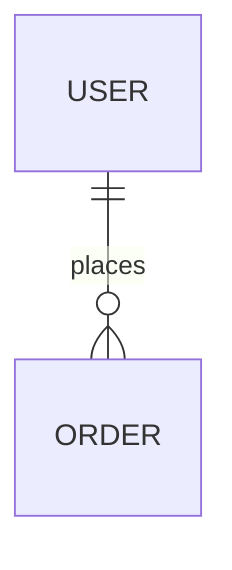

## 5. 데이터 모델

<!-- [information] 맨 위에 ERD. 제약마다 어느 요구사항을 지키는지. -->

```mermaid
erDiagram
  USER ||--o{ ORDER : places
```

### 5.1 <테이블>

| 열 | 타입 | 키·제약 | 요구사항 |
| --- | --- | --- | --- |
|  |  |  |  |
