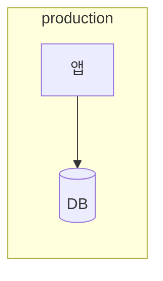

## 1. 환경

<!-- deployment diagram: 환경마다 무엇이 어디서 도는지. -->

```mermaid
flowchart LR
  subgraph prod[production]
    app[앱] --> db[(DB)]
  end
```

| 환경 | 주소 | 용도 | 배포 방법 |
| --- | --- | --- | --- |
|  |  |  |  |
