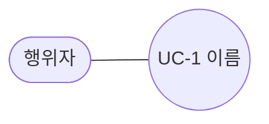

## 5. 사용사례

### 5.1 행위자

- 

### UC-1 <이름> (1차)

1. 
2. 

### 5.n 행위자와 사용사례

<!-- use case diagram: 어느 행위자가 어느 UC에 닿는지. Mermaid엔 use case 전용 문법이 없어서 flowchart로 그린다. -->

```mermaid
flowchart LR
  actor1([행위자]) --- uc1((UC-1 이름))
```
